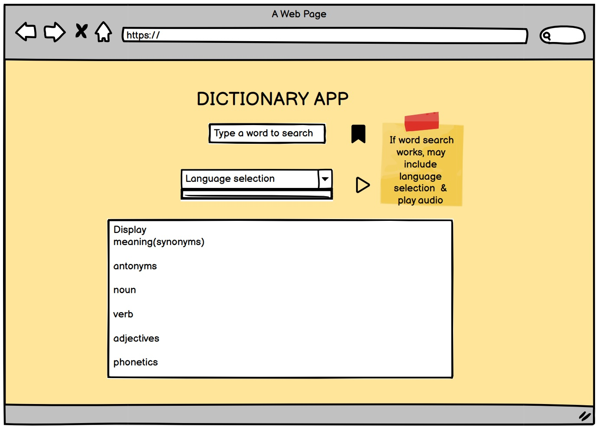

DICTIONARY APP

Dictionary App is a web application developed using React.js. It allows users to search for word definitions, listen to word pronunciation, and explore synonyms &antonyms. It also allows user to save their favorites and view it in the browser.

This project was bootstrapped with [Create React App]

[Working deployed link](https://nkmpriya16.github.io/dictionary-react-project/)

TECHNOLOGIES & TOOLS USED:
* React.js
* HTML
* CSS
* JavaScript
* VS Code

WIREFRAMES:

Struggles:

* Understanding useState and useEffect features
* CSS implementation

Learnings:

* How the axios request and async function works
* Accessing the JSON data and using it in the program
* Little about CSS

WISHLIST / FUTURE FEATURES:

* Planning to  implement language support
* User can select the word in favorites list and performs search operation

References: This app is developed using Free Dictionary API and Merriam-Webster Dictionary API
